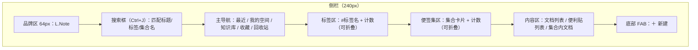
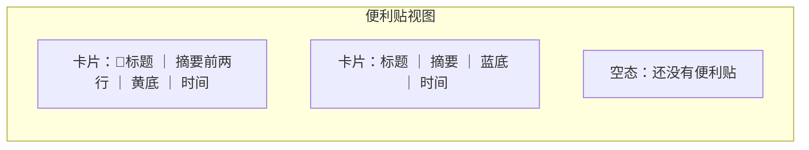
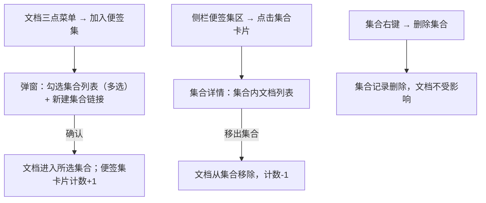

# L.Note 便签模块 PRD

> 阶段二：PRD　|　目标版本：v0.21.0　|　状态：待评审　|　更新日期：2026-08-12
> 需求描述遵循 EARS 原则。涉及用户主观偏好的交互细节均标注 `[Assumption — to be confirmed]`。

---

## 1. 需求背景

L.Note 已有五个侧栏视图（最近 / 我的空间 / 知识库 / 收藏 / 回收站）和收藏、置顶、批量管理、软删除能力，但文档仍只能按「时间」和「是否收藏」两个维度组织。参考「好用便签」的收纳理念（便签集、随手记、多彩皮肤），本模块为 L.Note 增加三套组织能力：**标签**（给文档打多个标签并按标签浏览）、**便利贴**（不建文档也能随手记录的轻量便签）、**便签集**（把多篇相关文档组合成虚拟分组）。三者全部本地存储，延续无账号、无联网的定位。

需求触发来源：用户明确提出参考 haoyong333.cn 的便签功能形态。`[Research-backed]`

## 2. 目标与成功标准

| 目标 | 可验证的成功标准 |
|---|---|
| 文档可按语义维度组织 | 任一文档可被打标签；侧栏标签视图可过滤出对应文档 |
| 提供轻量记录入口 | 用户可在 3 步内完成「新建便利贴 → 写入内容」 |
| 多文档可归组 | 一个文档可同时属于多个便签集，删除便签集不删除文档 |
| 数据不丢失 | 标签 / 便利贴 / 便签集在重启后完整还原 |

## 3. 用户与场景

| 角色 | 使用频率 | 核心场景 |
|---|---|---|
| 文档创作者 | 每日 | 给新文档打标签；在标签视图找回同类文档 |
| 会议记录者 | 每日 | 开会时快速写便利贴，会后整理成正式文档 |
| 项目负责人 | 每周 | 把需求/设计/测试文档加入「项目X」便签集，整体浏览 |

## 4. 功能概述表

| # | 模块 | 功能描述 |
|---|---|---|
| 1 | 标签 | 每个文档持有标签数组（tags，字符串数组）；可通过右键菜单、三点菜单、编辑页标签区添加/移除标签。标签随文档索引持久化。 |
| 2 | 标签视图 | 侧栏主导航下方新增「标签」区域，列出全部标签（名称 + 文档计数），点击标签过滤出所有带该标签的文档；再点取消过滤。 |
| 3 | 标签展示 | 文档列表条目在标题下方展示标签胶囊（#标签），点击胶囊跳转该标签的过滤视图。 |
| 4 | 标签管理 | 标签右键菜单支持「重命名」（全局生效）、「删除」（解除所有文档关联，空标签自动消失）。 |
| 5 | 便利贴列表 | 侧栏新增「便利贴」视图，卡片式展示全部便利贴（标题、摘要、颜色、置顶标记、时间）。 |
| 6 | 便利贴编辑 | 点击便利贴卡片进入编辑浮层，标题 + 多行正文，失焦自动保存。 |
| 7 | 便利贴属性 | 便利贴支持颜色（黄/蓝/绿/粉四色 `[Assumption]`）与置顶标记；置顶优先排序。 |
| 8 | 便利贴删除 | 复用软删除：删除进回收站，回收站内可恢复或彻底删除。 |
| 9 | 便签集视图 | 侧栏「便签集」区域展示集合卡片（名称 + 文档数）；点击进入集合，展示集合内文档列表。 |
| 10 | 集合成员管理 | 文档三点菜单「加入便签集」弹出选择列表（多选集合）；集合详情内可移除成员；批量模式支持多选后批量加入。 |
| 11 | 集合管理 | 集合右键菜单支持重命名 / 删除；删除集合仅移除分组引用，不影响文档。 |
| 12 | 搜索扩展 | 侧栏搜索框匹配范围扩展至标签名与便签集名。 |

## 5. 模块详述与原型

### 5.1 标签系统（功能 #1、#2、#3、#4、#12）

**数据模型**：文档对象新增 `tags: string[]`。标签不做层级，平铺展示 `[Assumption]`。

**业务逻辑**：
- 添加标签：输入标签名，去空格后若已存在则忽略重复；每文档标签上限 20 个 `[Assumption]`。
- 移除标签：删除单个标签；文档最后一个标签被移除后列表恢复正常展示。
- 重命名标签：任一入口重命名后全局生效（所有文档同步改名），重名合并。
- 删除标签：所有文档解除该标签引用；标签计数归零则从标签区消失。

**交互逻辑**：
- 打标签入口 A：文档右键菜单 → 「编辑标签」→ 浮层内输入/选择已有标签。
- 打标签入口 B：文档三点菜单 → 「编辑标签」（同一浮层）。
- 侧栏标签区：点击标签 = 进入该标签过滤视图（文档列表只显示带此标签的未删除文档）；再次点击或点击「最近」退出。
- 文档条目标签胶囊：点击跳转对应标签视图。

**原型（侧栏布局）**

### 5.2 便利贴（功能 #5、#6、#7、#8）

**数据模型**：便利贴作为独立文档记录 `kind: 'sticky'`，字段：`title`、`content`（多行文本）、`color`（默认黄）、`pinned`、`updated`、`deleted/deletedAt`。与普通文档共用 docs 数组与存储通道，仅类型不同 `[Assumption]`。

**业务逻辑**：
- 新建便利贴：底部 FAB 菜单新增「新建便利贴」，立即创建并打开编辑浮层。
- 编辑：标题单行输入，正文多行文本域，失焦或 Ctrl+S 保存。
- 颜色：编辑浮层顶部色板选择，即时生效。
- 置顶：卡片右上角置顶按钮切换；置顶便利贴排在前。
- 删除：软删除进回收站（回收站视图同样展示便利贴并支持恢复/彻底删除）。

**交互逻辑**：便利贴视图为空时显示空态「还没有便利贴，点击下方 + 新建」。

**原型（便利贴卡片）**

### 5.3 便签集（功能 #9、#10、#11）

**数据模型**：集合存于独立集合对象数组 `collections: [{ id, name, docIds: [] }]`，随索引持久化。文档不持有集合引用，集合持有文档引用（虚拟分组，`[Assumption]`，避免反向维护）。

**业务逻辑**：
- 创建集合：侧栏便签集区底部「＋ 新建集合」→ 输入名称（1~20 字）。
- 加入集合：文档三点菜单 → 「加入便签集」→ 勾选一个或多个集合 → 确认。
- 移出集合：集合详情内文档条目提供「移出集合」操作（不删除文档）。
- 批量加入：批量模式下勾选多篇文档后，批量工具条增加「加入集合」按钮。
- 删除集合：集合右键 → 删除；仅移除集合记录，文档保留在其他视图。

**交互逻辑**：侧栏便签集区展示集合卡片（名称 + 文档数）；点击进入集合详情，文档列表头部显示集合名与「移出集合」开关。

**原型（便签集交互）**

## 6. 规则与约束

| 项 | 规则 |
|---|---|
| 标签名 | 文本，1~20 字符，去首尾空格，空名忽略；大小写敏感 `[Assumption]` |
| 标签数量 | 单文档 ≤ 20 个 |
| 集合名 | 1~20 字符，必填；重名允许但建议合并 `[Assumption]` |
| 便利贴 | 标题 ≤ 50 字符；正文 ≤ 20000 字符（受 localStorage 限制，超出仅提示不阻塞） |
| 颜色 | 黄 #FFD43B / 蓝 #74C0FC / 绿 #69DB7C / 粉 #FAA2C1 `[Assumption]` |
| 排序 | 便利贴：置顶优先 → 更新倒序；标签区：按标签名拼音序 `[Assumption]` |

## 7. 边界与异常

| 场景 | 系统行为 |
|---|---|
| 标签重名合并 | 新标签与已有标签同名时合并为同一标签，文档计数累加 |
| 删除正在使用的标签 | 解除全部文档关联；相关文档标签区不再显示 |
| 删除集合 | 集合消失，成员文档保留在原视图与其它集合 |
| 便利贴超长正文 | 自动保存失败时保留内存内容并提示「内容超出本地存储上限」 |
| 回收站内的便利贴 | 展示删除时间，支持恢复 / 彻底删除 |
| 空标签视图 / 空集合 | 显示对应空态文案 |
| 搜索无结果 | 文档列表清空，显示「无匹配结果」 |

## 8. 验收标准（DoD）

| 功能 | 验收标准 |
|---|---|
| 打标签 | 右键/三点菜单可打开标签编辑浮层；添加、移除、去重正确；重启后标签保留 |
| 标签视图 | 点击标签过滤正确；再点退出过滤；标签计数准确 |
| 标签胶囊 | 文档条目显示标签；点击胶囊进入对应过滤视图 |
| 标签管理 | 重命名全局生效；删除标签解除关联；空标签消失 |
| 便利贴 CRUD | 新建/编辑/自动保存/删除/恢复全链路可用；颜色与置顶生效 |
| 便签集 | 创建/加入/移出/重命名/删除集合全部可用；删除集合不影响文档 |
| 批量加入 | 批量模式下可将多篇文档批量加入集合 |
| 数据持久化 | 标签/便利贴/集合重启后完整还原 |
| 回归 | 既有五视图、收藏、置顶、回收站功能不回归（E2E 冒烟全绿） |

## 9. 数据与指标（本地可观测）

| 指标 | 口径 | 用途 |
|---|---|---|
| 标签覆盖率 | 带标签文档 / 全部文档 | 评估标签功能使用深度 |
| 便利贴活跃度 | 便利贴 updated 分布 | 评估轻量记录价值 |
| 集合使用率 | 至少加入一个集合的文档占比 | 评估便签集价值 |

> 本地应用无远程埋点；上述指标基于 localStorage 离线计算。

---

## 后续流转提醒

- 本 PRD 待设计研发评审确认，重点确认 6 处 `[Assumption]`（颜色、层级、标签上限、数据模型、大小写、拼音序）。
- 评审通过后进入研发实现，建议按 标签 → 便利贴 → 便签集 顺序交付。
