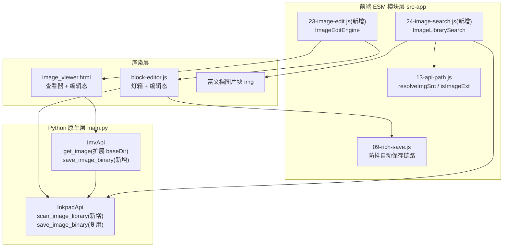
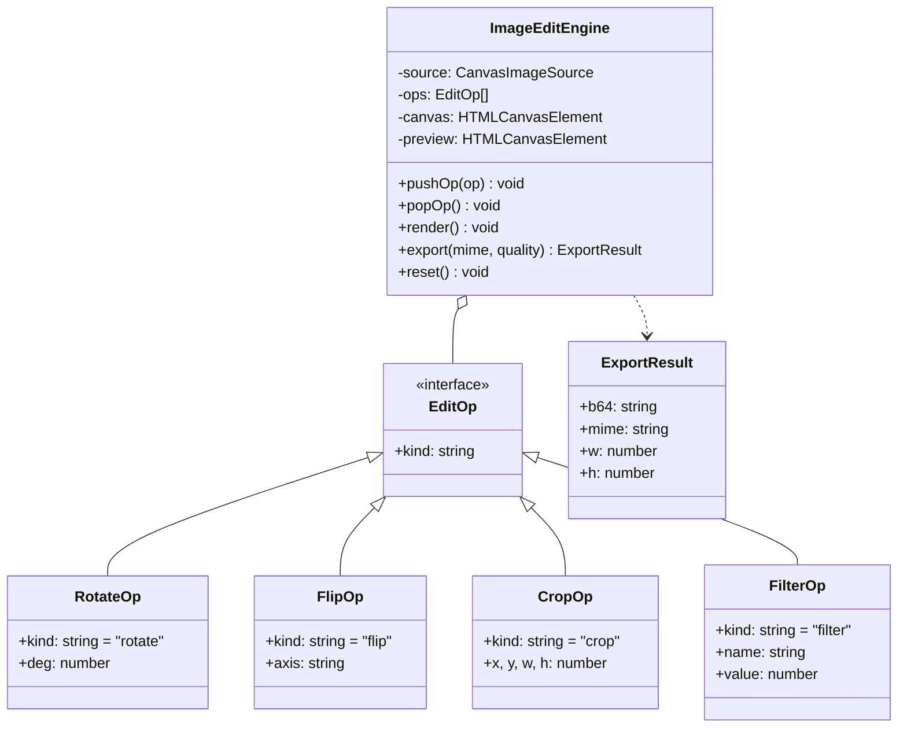
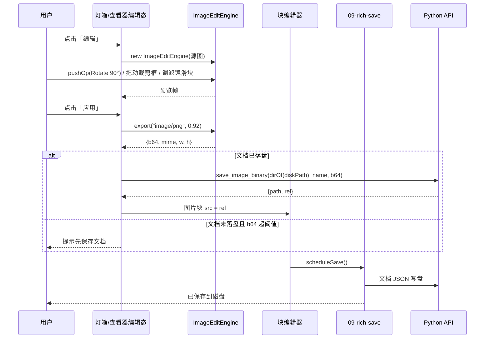
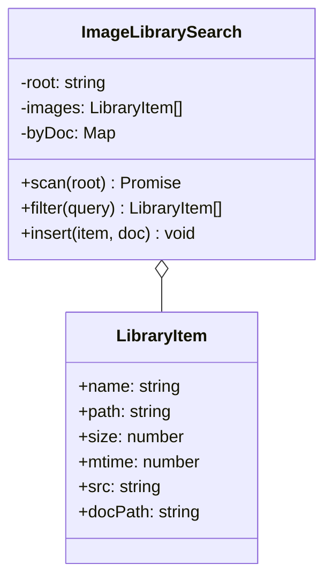
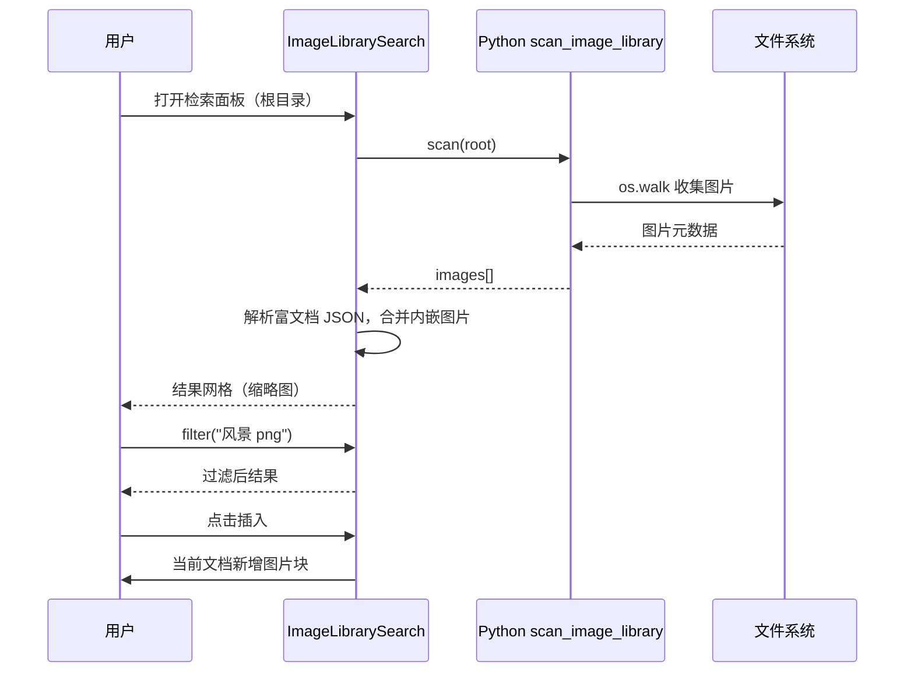

# 图片编辑与图片资产检索 详细设计

本文档对应 L.Note 富文档（Inkpad）的图片能力增强，覆盖两个阶段：Phase 1 为图片编辑，Phase 2 为图片资产检索。文档面向前端工程师与设计评审，描述系统的模块划分、接口契约、数据结构与迁移路径，不涉及逐行代码实现。

## 1 需求识别

| 维度 | 分类 | 依据 |
|------|------|------|
| 文档类型 | LLD（详细设计） | 需求已收敛为两个明确能力域，需要给出模块与接口级方案 |
| 系统阶段 | Brownfield | 在现有 pywebview + 原生 JS 单页应用上扩展，无新系统 |
| 受众 | 前端工程师 + 设计评审 | 改动集中在渲染层与桥接 API |
| 复杂度 | Medium（多模块，5–15 页） | 两个模块 + 少量 Python API，不涉及跨系统集成 |
| 上游工件 | 口头需求 | 无 PRD，假定需求清单见下文，均需确认 |

上游没有形成 PRD，以下假定需求在评审前需逐条确认：

- R1 用户在查看图片时能完成旋转、翻转、裁剪与缩放等几何操作，编辑结果可预览 [Hypothesis]
- R2 用户能对图片做亮度、对比度、饱和度、灰度与反色等基础滤镜调整 [Hypothesis]
- R3 编辑结果能持久化到当前文档，不破坏原图 [Hypothesis]
- R4 用户能按文件名、扩展名与所在位置检索本地图片，并把结果插入富文档 [Hypothesis]
- R5 编辑与检索全程离线可用，不新增第三方运行时依赖 [Hypothesis]
- R6 编辑与插入操作沿用现有 400ms 防抖自动保存链路，不引入新的保存入口 [Hypothesis]

## 2 设计概述

### 2.1 目的与范围

本设计为富文档图片块提供一条完整的"查看—编辑—回写"闭环，以及一个覆盖本地图库与富文档资产目录的检索面板。Phase 1 交付图片编辑：在现有灯箱（[block-editor.js](file:///d:/Users/differ/AiProject/2026-08-06-18-37-25%20-%20副本/notion-editor/js/block-editor.js#L455-L530) 的 `openImageLightbox`）与独立查看器窗口（[image_viewer.html](file:///d:/Users/differ/AiProject/2026-08-06-18-37-25%20-%20副本/notion-editor/image_viewer.html)）上叠加编辑态，编辑结果经 [save_image_binary](file:///d:/Users/differ/AiProject/2026-08-06-18-37-25%20-%20副本/notion-editor/main.py#L151-L169) 写入文档目录的 assets 或内嵌为 base64。Phase 2 交付检索：新增扫描 API 与检索面板，按名称、扩展名与所在文档过滤本地图片，支持插入当前文档。

明确不做的事：像素级选区与局部修图（仿制图章、去背景）、文字标注、多图层、多步撤销栈、OCR 文字识别、向量语义检索。这些能力要么需要引入大体积依赖（OCR 模型体积以百 MB 计），要么与"纯本地、零依赖"的产品定位冲突，均列入后续版本候选 [Expert judgment]。

### 2.2 设计目标

- 编辑操作全部在 Canvas 2D 管线内完成，导出为位图，覆盖现有全部 8 类图片扩展名 [Expert judgment]
- 回写不改变现有保存契约：图片先落盘到 assets 目录，块 src 更新为相对路径，再由现有防抖保存写文档 JSON [Expert judgment]
- 检索只依赖文件系统元数据与富文档 JSON 结构，不解析图片像素，扫描 1000 个文件的目标时延不超过 2 秒 [Hypothesis]
- 新增 Python API 不超过 2 个，前端新增 ESM 模块不超过 2 个，改动面收敛到渲染层 [Expert judgment]

### 2.3 约束

- Python 侧仅依赖标准库与 pywebview，不引入 Pillow、numpy 等图像库 [Data-backed]
- 前端不引入 npm 图像处理库，编辑管线只用原生 Canvas 2D [Data-backed]
- 富文档内嵌图片受 localStorage 约 5MB 上限约束，编辑结果超过阈值时必须落盘 [Data-backed]
- 项目构建链为 20-craft-init.js → js/app.js 的 ESM 汇总，新模块需在构建入口注册 [Expert judgment]

### 2.4 术语表

| 术语 | 含义 |
|------|------|
| 图片块 | 富文档 JSON 中的 `{id, type:"image", src, alt}` 块 |
| assets 目录 | 文档同级的 `assets/` 文件夹，存放图片等附件 |
| 灯箱 | 双击图片块弹出的页内放大查看层（block-editor.js 内实现） |
| 查看器窗口 | 主窗口外独立的图片查看原生窗口（image_viewer.html） |
| 编辑态 | 灯箱或查看器切换到可操作工具栏与裁剪框的状态 |
| 回写 | 把编辑导出的位图写入磁盘并更新图片块 src 的过程 |

## 3 系统架构

系统保持现有的三层结构不变：Python 原生层（main.py 的 API 类）提供文件系统能力，前端 ESM 模块层承载业务逻辑，DOM 块编辑器负责渲染与交互。Phase 1 与 Phase 2 都以新 ESM 模块的形式嵌入前端，Python 侧只做最小扩展。



图中三层的关系：检索模块（24-image-search.js）调用 Python 扫描 API 拿到图片清单，用 13-api-path.js 的路径工具把路径解析为可加载的 file:// 地址供缩略图与插入使用；编辑引擎（23-image-edit.js）同时服务灯箱与查看器窗口，导出结果通过 Python 的 `save_image_binary` 落盘，再走 09-rich-save.js 的既有保存链更新文档。查看器窗口无法直接触达主窗口的保存链，因此由 ImvApi 暴露与主 API 同签名的落盘方法，二者共用模块级实现。

技术选型围绕"零新增依赖"展开。Canvas 2D 是 WebView2（Chromium 内核）原生能力，旋转、翻转、裁剪与滤镜均有直接 API 或可通过 `getImageData` 像素操作实现，无引入第三方库的必要 [Expert judgment]。检索侧只扫文件元数据，不解析图片内容，因此 Python 用 `os.walk` 即可完成，不需要图像库参与 [Expert judgment]。

## 4 模块设计

### 4.1 图片编辑模块（Phase 1）

新前端模块 `src-app/23-image-edit.js`，导出 `ImageEditEngine` 类，是编辑能力的唯一实现方。

| 元素 | 内容 |
|------|------|
| 职责 | 持有源图与操作序列，驱动 Canvas 渲染管线，导出编辑结果 |
| 输入 | 已加载的位图（HTMLImageElement / ImageBitmap）、操作命令（旋转/翻转/裁剪/滤镜） |
| 输出 | 预览渲染；导出结果为 `{b64, mime, w, h}` |
| 依赖 | 无第三方依赖；被灯箱与查看器窗口调用 |
| 边界 | 不做撤销栈、多图层、选区修图；SVG 与动图导出前栅格化 |



编辑管线采用"操作序列 + 惰性重绘"模型。每次 `pushOp` 只把操作追加到数组，`render` 时从源图开始依次应用全部操作，得到预览帧；`export` 走同一管线但使用全分辨率画布，并把结果编码为 base64。几何操作先于滤镜执行，滤镜在几何变换后的位图上逐像素处理，保证裁剪区域与滤镜效果一致。

非平凡逻辑集中在两个函数。旋转与翻转通过 `canvas` 的 `translate`/`rotate`/`scale` 组合实现，裁剪用 `drawImage` 的源矩形参数完成；滤镜中的灰度、反色与亮度/对比度/饱和度通过 `getImageData` 逐像素计算，像素级处理在大图上耗时可观，因此预览阶段对源图做最长边 2048px 的降采样，导出阶段才使用原始分辨率 [Expert judgment]。



时序图展示的是应用编辑的主路径。已落盘文档把导出位图写到 `assets/`，块 src 更新为相对路径；未落盘文档仅在导出体量可控时内嵌 base64，否则阻止应用并提示先保存。两条路径最终都汇入现有保存链，不产生新保存入口。

回写策略的规则按文档状态与导出体量分档：已落盘文档一律写 assets 并改用相对路径，与现有"选择图片"的行为一致；未落盘文档在导出 base64 小于 3MB 时内嵌，超过时提示先保存。3MB 阈值预留了约 2MB 的存量余量以规避 localStorage 5MB 上限 [Expert judgment]。

### 4.2 图片资产检索模块（Phase 2）

新前端模块 `src-app/24-image-search.js`，导出 `ImageLibrarySearch` 类，负责本地图片的扫描、过滤与插入。

| 元素 | 内容 |
|------|------|
| 职责 | 扫描指定根目录的图片文件与富文档内嵌图片，按条件过滤并支持插入 |
| 输入 | 根目录路径、过滤条件（关键字/扩展名/所在文档） |
| 输出 | 结果数组，每项含可加载的 src、名称、路径、尺寸与所在文档 |
| 依赖 | Python `scan_image_library`；13-api-path.js 的 `isImageExt`/`resolveImgSrc` |
| 边界 | 不做图片内容识别，不做跨磁盘全局索引；索引保存在内存 |



检索分两路汇合。第一路是磁盘图片：Python `scan_image_library` 递归遍历根目录，按 `IMG_EXTS` 过滤返回元数据；第二路是富文档内嵌图片：前端读取同目录下 `.json` 富文档，解析块数组提取 `type:"image"` 的块，把 base64 内嵌项与其所在文档关联。过滤在内存索引上执行，关键字匹配文件名，扩展名匹配后缀，所在文档匹配 docPath。



时序图展示检索面板的完整调用链：用户打开面板时传入根目录，`scan` 调 Python 扫描 API 拿磁盘图片元数据，随后在内存里解析富文档 JSON 合并内嵌图片，网格渲染缩略图；用户输入过滤条件后 `filter` 在内存索引上筛选，点击结果由 `insert` 在文档中新增图片块。面板打开时执行首次扫描，之后监听 `docs:changed` 与文件树目录切换事件做增量失效重建。目录扫描采用分批推进（每批 200 项），避免大目录一次性阻塞渲染线程；缩略图用懒加载，仅对进入视口的项设置 `img.src` [Expert judgment]。

## 5 接口设计

### 5.1 接口清单

| 标识 | 位置 | 操作 | 状态 |
|------|------|------|------|
| I1 | Python InkpadApi | `save_image_binary(dirpath, filename, content_b64, subdir)` | 复用，不改签名 |
| I2 | Python InkpadApi | `scan_image_library(root, max_depth)` | 新增 |
| I3 | Python InkpadApi | `open_image_viewer_window(src, name, base_dir)` | 修改，加第三参数 |
| I4 | Python ImvApi | `get_image()` | 修改，响应增 baseDir |
| I5 | Python ImvApi | `save_image_binary(...)` | 新增，与 I1 同实现 |
| I6 | 前端 | `ImageEditEngine.pushOp/popOp/render/export/reset` | 新增 |
| I7 | 前端 | `ImageLibrarySearch.scan/filter/insert` | 新增 |

### 5.2 接口契约

I1 `save_image_binary(dirpath: str, filename: str, content_b64: str, subdir: str = "assets")`

| 字段 | 值 |
|------|-----|
| 用途 | 把 base64 图片写入 `dirpath/subdir/`，重名自动加序号 |
| 参数约束 | `dirpath` 必须存在；`content_b64` 为纯 ASCII base64 |
| 成功响应 | `{path: 绝对路径(正斜杠), rel: "assets/文件名"}` |
| 错误响应 | `{error: "目标目录无效: ..."}` 等 |

I2 `scan_image_library(root: str, max_depth: int = 4)`

| 字段 | 值 |
|------|-----|
| 用途 | 递归扫描根目录下的图片文件，返回元数据清单 |
| 参数约束 | `root` 为存在的目录；`max_depth` 限制递归层数防止失控 |
| 成功响应 | `{images: [{name, path, size, mtime}], scanned: 数量}` |
| 错误响应 | `{error: "目录不存在: ..."}` |
| 过滤规则 | 扩展名命中 `IMG_EXTS`（png/jpg/jpeg/gif/webp/bmp/svg/ico） |

I3 `open_image_viewer_window(src: str, name: str = "", base_dir: str = "")`

| 字段 | 值 |
|------|-----|
| 用途 | 打开独立图片查看器窗口，可携带编辑保存的目标目录 |
| 变更 | 新增可选 `base_dir`；为 `""` 时编辑保存走「另存为」对话框 |
| 内部行为 | 写入 `pending_image = {src, name, baseDir}` |

I4 `get_image()`

| 字段 | 值 |
|------|-----|
| 用途 | 查看器窗口取回主窗口传入的图片数据 |
| 响应 | `{src, name, baseDir}`；`baseDir` 可为空串 |

I5 `save_image_binary(...)` 与 I1 签名一致，供查看器窗口在编辑后把结果写回 `baseDir/assets/`；复用模块级实现，避免两份逻辑漂移。

I6 前端 `ImageEditEngine`

| 方法 | 签名 | 说明 |
|------|------|------|
| 构造 | `new ImageEditEngine(img)` | `img` 为已加载的位图元素 |
| pushOp | `(op) → void` | 追加操作并触发预览重绘 |
| popOp | `() → EditOp\|null` | 移除最后一项操作 |
| render | `() → void` | 按操作序列重绘预览画布 |
| export | `(mime, quality) → {b64, mime, w, h}` | 全分辨率导出 |
| reset | `() → void` | 清空操作，恢复原图 |

I7 前端 `ImageLibrarySearch`

| 方法 | 签名 | 说明 |
|------|------|------|
| scan | `(root) → Promise<int>` | 扫描并建立内存索引，返回图片总数 |
| filter | `(query) → LibraryItem[]` | 按关键字/扩展名/所在文档过滤 |
| insert | `(item, doc) → void` | 在当前文档追加图片块并触发保存 |

### 5.3 一致性说明

I1 在本设计中同时被灯箱回写与查看器窗口回写引用，两处调用参数语义完全一致，均以 `rel` 作为图片块 src。I3 的 `base_dir` 与 I4 响应的 `baseDir` 指向同一个值，前端从查看器窗口读取的保存目录与主窗口传入的目录不产生第二份副本 [Expert judgment]。

## 6 数据设计

### 6.1 图片块数据结构

富文档图片块保持现有形态不变：`{id, type:"image", src, alt}`。`src` 有三种取值，编辑与检索都基于同一套判定规则：

| 形态 | 示例 | 判定 |
|------|------|------|
| 相对路径 | `assets/photo_1.png` | 非 `data:`/`file:`/http 前缀 |
| 绝对路径 | `file:///C:/xxx/photo.png` | `file:` 前缀 |
| 内嵌 | `data:image/png;base64,...` | `data:` 前缀 |

编辑回写后，图片块优先落到"相对路径"形态，与现有"选择图片"插入路径保持一致；内嵌形态仅在未落盘文档且导出体量受控时保留 [Expert judgment]。

### 6.2 回写数据流

一次编辑应用产生的数据流转为：`ImageEditEngine.export` 产出 base64 → `save_image_binary` 写入 `assets/` 并返回相对路径 → 图片块 `src` 更新 → `scheduleSave` 触发 400ms 防抖 → 文档 JSON 写盘。落盘与文档保存分属两个 API 调用，图片先于文档写入，因此文档 JSON 不会引用尚未存在的图片文件 [Expert judgment]。

### 6.3 检索索引

检索索引是内存态结构，随扫描重建，不落盘：

```
{
  root: "/path/to/root",
  scannedAt: 1720000000000,
  images: [{ name, path, size, mtime, src, docPath }],
  byDoc: { "/path/to/doc.json": [0, 3, 5] }
}
```

`byDoc` 以富文档路径为键，值为 `images` 数组的下标列表，供"所在文档"维度过滤使用。索引的生命周期由两类事件驱动：文件树切换目录时整索引失效重建；`docs:changed` 时仅增量更新内嵌图片部分 [Expert judgment]。

## 7 影响与迁移

### 7.1 现状分析

现有图片能力只覆盖插入与查看：插入支持选文件、粘贴与文件树三种来源；查看支持灯箱缩放平移与独立窗口。像素级处理、批量回写与跨文档资产检索均为空白，本次改动不触碰现有查看逻辑的默认行为，编辑态作为可选的叠加层存在。

### 7.2 改动点清单

| 文件 | 改动 | 风险 |
|------|------|------|
| main.py | InkpadApi 增 `scan_image_library`；ImvApi 增 `save_image_binary`；`open_image_viewer_window` 与 `get_image` 扩展字段 | 低，纯增量 |
| image_viewer.html | 顶部栏增「编辑」按钮，引入编辑态面板 | 中，编辑态 UI 与现有缩放逻辑同窗口共存 |
| js/block-editor.js | 灯箱增「编辑」入口，编辑态复用 23-image-edit.js | 中，灯箱 DOM 结构扩展 |
| src-app/23-image-edit.js | 新增 | 低 |
| src-app/24-image-search.js | 新增 | 低 |
| src-app/20-craft-init.js | 注册两个新模块到构建链 | 低 |
| css/inkpad-rich.css | 编辑面板与检索面板样式 | 低 |

### 7.3 迁移顺序与回滚

按依赖方向分两步推进。第一步交付 Phase 1：先落 ImageEditEngine 与灯箱编辑态，验证回写路径，再接查看器窗口编辑态。第二步交付 Phase 2：先加 `scan_image_library`，再接检索面板。两个阶段的前端模块彼此独立，Phase 2 不依赖 Phase 1 的任何代码。

回滚按模块粒度执行：删除 20-craft-init.js 中对应模块的注册即可回到编辑态与检索面板缺失的状态，Python 新增的两个方法与扩展字段不参与旧逻辑，无兼容性影响 [Expert judgment]。

## 8 非功能设计与错误处理

### 8.1 性能目标

预览交互从操作触发到画面刷新目标 200ms 内完成，依靠最长边 2048px 的降采样保证 [Hypothesis]。目录扫描按每批 200 项分块推进，避免大目录阻塞渲染线程；扫描 1000 文件目标时延 2 秒内（本地磁盘 SSD 场景）[Hypothesis]。缩略图仅在进入视口时加载，网格滚动不产生一次性批量 IO [Expert judgment]。

### 8.2 错误分类与处理

| 场景 | 表现 | 处理 |
|------|------|------|
| SVG/ICO/动图进入编辑 | 编辑前栅格化 | 引擎构造时先绘制到离屏画布再接管，导出统一 PNG |
| 导出 base64 超 3MB 且文档未落盘 | 阻止应用 | toast 提示先保存文档，编辑面板保持打开不丢操作 |
| 落盘失败（目录被删/磁盘满） | 应用失败 | 保留面板与操作序列，提示重试；原图不受影响 |
| 源图加载失败 | 编辑态不可进 | 显示占位提示，仍可查看器打开失败原因 |
| 扫描目标被占用/无权限 | 单项跳过 | 返回结果剔除失败项，面板底部提示跳过数量 |
| 大图导出内存压力 | 导出超时 | 预览降采样兜底；导出失败时提示改用更小原图 |

所有失败路径都遵循同一条原则：不修改图片块 src、不写入半成品文件、编辑面板的当前操作序列在失败后可重试或放弃，原图始终可恢复 [Expert judgment]。

## 9 评审要点

- 假定需求 R1–R6 是否与实际预期一致，特别是编辑能力边界（不做选区修图）与检索范围（不做内容识别）
- 回写策略中 3MB 阈值与"未落盘文档提示先保存"的取舍是否可接受
- `open_image_viewer_window` 增加第三参数对现有调用方的影响（现有调用不传该参数，行为不变）
- Phase 2 检索的"所在文档"维度依赖解析同目录富文档 JSON，是否满足使用场景
