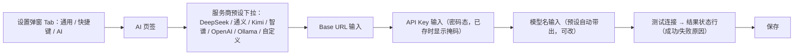
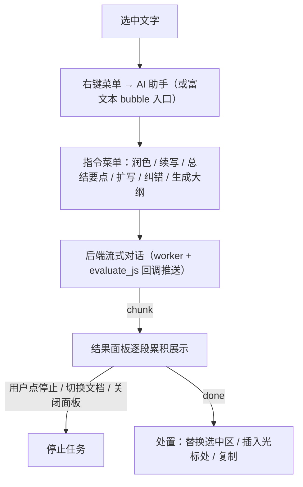
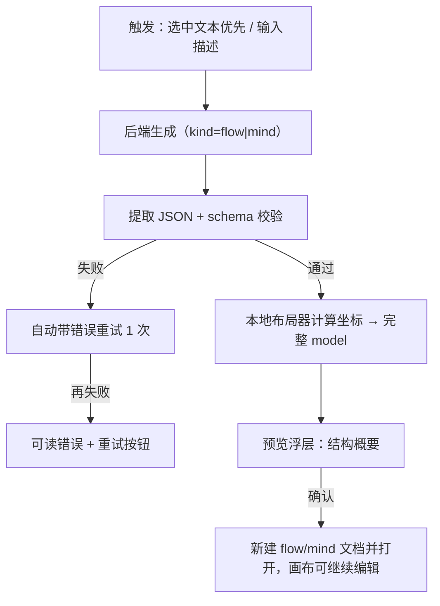

# L.Note AI 模块 PRD

> 阶段二：PRD　|　目标版本：v0.22.0　|　状态：已评审通过，研发完成（测试验收中）　|　更新日期：2026-09-11
> 需求描述遵循 EARS 原则。涉及用户主观偏好的交互细节均标注 `[Assumption — to be confirmed]`。

---

## 1. 需求背景

L.Note 定位纯本地文档编辑器，已具备文本、富文档、流程图（flow）、思维导图（mind）与便签能力，并沉淀了 worker 线程 + `evaluate_js` 回调的后端通道（翻译功能即此模式）与「AI 只产结构、坐标本地算」的图数据模型约束。

用户提出「增加 AI 相关功能」。经方案比对，本模块采用 **BYOK（自带 Key）接入 OpenAI 兼容接口**：不引入 L.Note 云端服务、账号与中转计费，请求直连用户配置的 Base URL；API Key 存 Python 侧 `ai-config.json`（`%LOCALAPPDATA%\L.Note`），不回传明文。首期范围 = **BYOK 接入与 AI 设置 + 选中即用助手 + AI 生成流程图/思维导图**。`[Research-backed]`

## 2. 目标与成功标准

| 目标 | 可验证的成功标准 |
|---|---|
| 用户可自备 Key 接入任意 OpenAI 兼容服务 | 设置面板配置 Base URL/Key/模型后，「测试连接」成功并可发起真实对话 |
| Key 不泄露 | Key 只存在于 Python 侧 `ai-config.json`；任何前端回读只得到 hasKey / 掩码 |
| 写作辅助顺手可用 | 文本/富文档中选中文字可唤起助手，指令返回可流式展示并回填到文档 |
| 文字可一键成图 | 选中文本或输入描述可生成 flow/mind 结构，确认后成为可继续编辑的本地图文档 |
| 生成质量稳定可控 | AI 只产结构 JSON；坐标由本地布局器计算；结构非法时自动重试并有兜底提示 |
| 不影响既有功能 | 既有翻译、文本/富文档编辑、flow/mind 编辑、自动更新链路不回归 |

## 3. 用户与场景

| 角色 | 使用频率 | 核心场景 |
|---|---|---|
| 文档创作者 | 每日 | 润色 / 扩写 / 纠错选中段落；把会议要点续写成文 |
| 阅读整理者 | 每周 | 长文选中后「总结要点」 |
| 结构化作者 | 每周 | 把一段流程描述变成流程图；把大纲变成思维导图 |
| 隐私敏感用户 | 不定 | 配置本地 Ollama，全程离线使用 AI 能力 |

## 4. 功能概述表

| # | 模块 | 功能描述 |
|---|---|---|
| 1 | BYOK 设置 | 服务商预设：内置 DeepSeek / 通义 / Kimi / 智谱 / OpenAI / Ollama 常用 Base URL 与默认模型名，选择即填入。 |
| 2 | BYOK 设置 | 自定义接入：手动填写 Base URL、API Key、模型名；「测试连接」发起最小请求校验。 |
| 3 | BYOK 设置 | 密钥安全：Key 仅存 Python 侧 `ai-config.json`；前端只显示 hasKey/掩码；日志不落 Key 与明文请求体。 |
| 4 | 选中即用助手 | 入口：文本（CodeMirror）与富文档（块编辑器）中选中文字后，右键菜单「AI 助手」或浮动工具条出现助手入口（未选中不可用）。 |
| 5 | 选中即用助手 | 指令集：润色 / 续写 / 总结要点 / 扩写 / 纠错 / 生成大纲。 |
| 6 | 选中即用助手 | 流式输出：回复经 SSE 分段推送并累积渲染，可随时「停止」。 |
| 7 | 选中即用助手 | 结果处置：支持替换选中区 / 插入到光标处 / 复制到剪贴板。 |
| 8 | 未配置引导 | 未配置或 Key 无效时，调用助手/生成前弹出引导进入设置；功能按钮置灰并提示。 |
| 9 | 图表生成 | 入口：选中文本优先作为上下文；未选中时弹输入框填描述。目标 kind：flow / mind。 |
| 10 | 图表生成 | 结构产出：AI 返回 flow（nodes/edges，节点类型 start/end/process/decision）或 mind（root-children 树）结构 JSON，不含坐标。 |
| 11 | 结构校验 | 对 AI 输出做 schema 校验与 JSON 提取；失败自动带错误信息重试 1 次，仍失败给出可读错误与「重试」按钮。 |
| 12 | 本地布局落图 | 校验通过后由本地布局器计算坐标与锚点，生成完整 model；预览确认后新建为 flow/mind 文档并打开，可在画布内继续编辑。 |
| 13 | 高级参数 | （P1）温度、单次请求超时、最大输出长度设置。 |
| 14 | 自定义指令 | （P1）用户可保存自定义 prompt 模板进助手指令菜单。 |
| 15 | 现有图扩展 | （P1）对当前已打开的 flow/mind 图，请求「扩充分支 / 重新梳理」。 |
| 16 | 结构复用 | （P1）生成的结构 JSON 可复制，便于外部再利用。 |

## 5. 模块详述与原型

### 5.1 BYOK 接入与 AI 设置（功能 #1、#2、#3、#8、#13）

**数据模型**：Python 侧配置文件 `ai-config.json`（位于 `%LOCALAPPDATA%\L.Note`）：

```json
{ "version": 1, "baseUrl": "https://api.deepseek.com", "apiKey": "", "model": "deepseek-chat", "temperature": 0.7, "timeoutSec": 60, "maxTokens": 2048 }
```

前端设置面板读取到的是脱敏视图（不含明文 Key）：`{ baseUrl, model, hasKey: true, keyMasked: "sk-****abcd" }`。

**业务逻辑**（EARS）：
- 当用户选择任一服务商预设时，Base URL 与默认模型名自动填入对应表单。
- 当用户点击「保存」时，前端仅在有改动的 Key 输入框非空时提交完整 Key；后端 `ai_save_config` 落盘配置。
- 当用户点击「测试连接」时，后端发起一次最小 chat 请求（消息 1 条、`max_tokens` 极小），通过回调返回 `ok/错误信息`。
- 当任意 AI 功能被调用且配置缺失/Key 为空时，入口置灰并提示，点击提示跳转设置面板 AI 页签。
- 当应用读取配置时，任何回传给前端的对象都不含 `apiKey` 明文；日志记录不输出 Key 与请求体明文。

**交互逻辑**：设置弹窗新增「AI」页签：服务商预设下拉 → Base URL 输入 → API Key 输入（密码态 + 掩码提示）→ 模型名输入（带预设建议）→「测试连接」状态行 → 保存。保存成功后全局解除 AI 功能置灰。

**原型（设置面板 AI 页签）**



### 5.2 选中即用助手（功能 #4、#5、#6、#7、#14）

**数据模型**：运行期单任务会话对象（不持久化）：

```js
{ sessionId, kind: "text", sourceText, prompt, status: "idle|streaming|done|stopped|error", resultText: "" }
```

**业务逻辑**（EARS）：
- 当用户在文本编辑器（CodeMirror）中选中文字且选区非空时，右键菜单出现「AI 助手」子菜单（润色 / 续写 / 总结要点 / 扩写 / 纠错 / 生成大纲）。
- 当用户在富文档块编辑器中选中文字且选区非空时，浮动工具条（bubble）出现「AI 助手」入口，展开同款指令菜单。
- 当用户点击任一指令时，前端将指令名与选中文本组装为请求，调用后端发起流式对话；同一时刻仅允许 1 个任务，触发新任务前先停止旧任务 `[Assumption]`。
- 当后端流式返回分片时，前端按序累积渲染到助手结果面板（独立浮层），直至 `done` / `stopped` / `error`。
- 当用户点击「停止」时，前端调用停止接口，后端置取消标记中断请求，不再回调新分片。
- 当结果完成后，用户可选择「替换选中区」（撤销选中原文并插入结果）、「插入到光标」（保留原文，结果插入原选区尾部 `[Assumption]`）或「复制」。

**交互逻辑**：结果面板为浮层（标题 = 指令名，正文 = 流式文本，底部 = 三个处置按钮 + 停止按钮 + 关闭）。生成中切换文档或关闭面板时停止任务 `[Assumption]`。

**原型（助手交互流）**



### 5.3 AI 图表生成（功能 #9、#10、#11、#12、#15、#16）

**数据模型**：AI 输出「结构 JSON」（不含坐标、不含 id 布局）：

```jsonc
// flow（kind=flow）
{ "title": "登录流程", "nodes": [ { "id": "n1", "type": "start", "text": "开始" }, { "id": "n2", "type": "process", "text": "输入账号" }, { "id": "n3", "type": "decision", "text": "校验通过？" } ], "edges": [ { "from": "n1", "to": "n2", "text": "" }, { "from": "n2", "to": "n3" } ] }

// mind（kind=mind）
{ "title": "项目计划", "root": { "text": "项目计划", "children": [ { "text": "目标", "children": [ { "text": "指标" } ] } ] } }
```

本地布局器输入上述结构，输出与现有文档 `content` 同构的完整 model：flow 补 `x/y`、`fromAnchor/toAnchor`、`lanes`（默认空泳道）与 `id` 规范化；mind 补节点 `id`、`collapsed:false` 及主题样式字段。结构 JSON 与 doc.content 两者同构（`JSON.parse → mod.init` 路径一致）。

**业务逻辑**（EARS）：
- 当用户在文本/富文档编辑器中通过右键或工具条触发「AI 生成流程图 / 思维导图」时，优先取当前选中文本作为上下文；未选中则弹出描述输入框。
- 当后端完成生成并回传文本时，前端提取 JSON 并做 schema 校验；校验失败时带错误信息重试 1 次，仍失败则提示「生成结果不是有效的图结构」并给出重试按钮。
- 当结构校验通过时，调用本地布局器生成带坐标的完整 model。
- 当用户预览并确认时，新建 `kind=flow` 或 `kind=mind` 文档（`content = JSON.stringify(model)`），写入索引并打开进入画布，可继续编辑。
- 当配置缺失时，生成入口置灰并引导到设置（同 #8）。

**交互逻辑**：生成采用「处理中 → 结构预览 → 确认落图」两段式：先显示文本加载态（不直接落图），校验与布局完成后在预览浮层展示结构清单（节点/分支概要），用户确认才新建文档，避免半成品污染文档库。

**原型（生成落图流）**



## 6. 规则与约束

| 项 | 规则 |
|---|---|
| Base URL | 必填，须为 `http(s)://` 开头的 OpenAI 兼容 `/chat/completions` 端点前缀；预设值见产品内列表，允许手改 |
| API Key | 必填（Ollama 本地可留空）；不写入 localStorage；回读仅返回 hasKey/掩码 |
| 模型名 | 必填；预设带默认值，可手改 |
| 选中文本长度 | 助手 ≤ 4000 字符 `[Assumption]`；图表生成 ≤ 8000 字符 `[Assumption]`，超出截断并提示 |
| 并发 | 同一时刻仅 1 个 AI 任务；新任务先停旧任务 |
| 流式 | SSE（`stream:true`）；首字节超时默认 60s，空闲静默上限 60s `[Assumption]` |
| 输出长度 | `max_tokens` 默认 2048，可配置（P1） |
| 日志 | 不记录 Key、请求/响应体明文；仅记录耗时、HTTP 状态、字符数等聚合信息 |
| 生成产物 | 预览确认后新建为独立 flow/mind 文档；不覆盖原文档 |
| 图模型 | AI 不产出坐标；坐标一律由本地布局器计算 |

## 7. 边界与异常

| 场景 | 系统行为 |
|---|---|
| 网络失败 / 服务商鉴权失败 | 助手面板/生成预览展示可读错误，不自动重试；提供「重试」按钮 |
| 返回体非法（非 JSON / schema 不符） | 自动带错误重试 1 次；仍失败提示「生成结果不是有效的图结构」 |
| 流中断 / 超时无分片 | 判定 error 并提示网络不稳定，已接收内容保留可复制 |
| 空选区触发助手 | 入口禁用；生成流程则弹描述输入框 |
| 生成中用户切换文档 / 关闭面板 | 停止当前任务，回调丢弃 `[Assumption]` |
| Key 中途失效 | 下次调用返回 401 类错误，提示进入设置重新配置 |
| Ollama 未启动 / 模型名错误 | 测试连接返回可读错误（连接失败 / 模型不存在） |
| 重复触发同一指令 | 先停止旧任务再发起新任务，防止回调串扰 |
| 超长选中文本 | 按上限截断并在请求前提示「内容过长，已截断到前 N 字符」 |
| 生成完成但用户未确认 | 不产生任何新文档；关闭预览即丢弃 |

## 8. 验收标准（DoD）

| 功能 | 验收标准 |
|---|---|
| 服务商预设 | 6 个预设可一键填入 Base URL + 默认模型 |
| 自定义接入 | 手填 Base URL/Key/模型可保存并持久化 |
| Key 安全 | 前端回读不含明文 Key；`ai-config.json` 落盘可读；日志无 Key/明文请求体 |
| 测试连接 | 合法配置返回成功；错误配置返回可读原因（401/超时/连接失败） |
| 未配置引导 | 未配置时 AI 入口置灰并可跳转设置 |
| 助手入口 | 文本与富文档选中后可见；未选中不可用 |
| 指令集 | 6 种指令均返回合理结果并流式展示 |
| 结果处置 | 替换/插入/复制三种处置在文本与富文档中均正确生效 |
| 停止生成 | 点击停止后不再追加内容，任务状态为 stopped |
| 图表生成 | 文本/描述可分别生成 flow 与 mind 结构并进入预览 |
| 结构校验 | 非法输出重试 1 次；仍失败有可读错误与重试按钮 |
| 本地布局 | 落图坐标正确、无重叠异常；画布可继续编辑且保存还原一致 |
| 落图产物 | 确认后生成独立 flow/mind 文档，出现在「最近」，重启后保留 |
| 回归 | 翻译、文本/富文档编辑、flow/mind 手动编辑、自动更新链路冒烟全绿 |
| 构建 | 前端构建、py_compile、单元测试通过（按项目构建链） |

## 9. 数据与指标（本地可观测）

| 指标 | 口径 | 用途 |
|---|---|---|
| AI 配置完成率 | 本地是否有 `ai-config.json` 且 Key 非空 | 评估 BYOK 接入门槛 |
| 助手使用计数 | 本地计数：各指令调用成功/失败次数 `[Assumption]` | 评估助手价值与失败率 |
| 生成落图数 | 本地计数：AI 生成的 flow/mind 文档数 | 评估成图价值 |

> 本地应用无远程埋点；以上计数仅存本机，可随时清除，不包含任何文本内容。

---

## 后续流转提醒

- 本 PRD 待设计研发评审确认，重点确认 [Assumption]：选区长度上限、并发单任务、插入位置、中断丢弃、本地计数口径、8 处待确认项。
- 技术评审要点（供评审记录使用）：沿用 translate 的 worker + `evaluate_js` 回调通道；InkpadApi 新增 `ai_get_config / ai_save_config / ai_test / ai_chat / ai_stop`；纯标准库 urllib 实现 SSE 流式读取；设置弹窗新增 AI 页签；编辑器选区分别走 `cm.getSelection()` 与块编辑器选区封装；布局器为纯函数模块，输入结构 JSON 输出完整 model。
- 评审通过后进入研发实现，建议按 M1 设置 → M2 助手 → M3 图表生成顺序交付。
